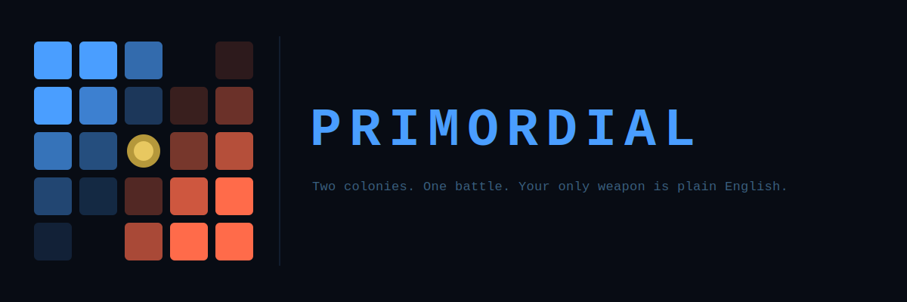

Two colonies fight for control of a petri dish. Before the battle starts, each player writes a plain-English strategy — "defend and grow until round 10, then attack" — and an AI converts it into a set of rules. The entire game resolves in one shot. Then you watch it play out, round by round.

No buttons. No mid-game input. Just one strategy, written blind.

**[How to play](how-to-play.md)** · **[Design](design.md)** · **[Terms](https://amphro.com/terms/)** · **[Privacy](https://amphro.com/privacy/)**

---

> This is an experimental hobby project. Use at your own risk. No guarantees of uptime or data retention.
